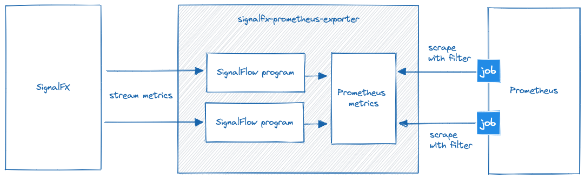

# SignalFX Prometheus exporter

SignalFX Prometheus exporter provides a Prometheus scrape target for SignalFX metrics.

It leverages the [SignalFlow](https://dev.splunk.com/observability/docs/signalflow/) language to filter, analyze and aggregate data from the Splunk Observability Cloud and offers the extracted data as a standard Prometheus scrape target.

SignalFX Prometheus exporter can be used to bring Splunk Observability Cloud data into existing Prometheus environments, allowing common dashboarding and alerting rules to be applied.

## Configuration
SignalFX Prometheus exporter is configured via a [configuration file](docs/configuration.md) and commandline flags.

The configuration file declares how data is read from SignalFX and how it is processed into scrapable Prometheus metrics.

Each data flow is described as a `query` defined in the [SignalFlow](https://dev.splunk.com/observability/docs/signalflow/) language. Such a query yields metrics from single or multiple time series.

The metrics provided by the `query` are translated to Prometheus compatible metrics. The `prometheusMetricTemplate` section of a `flow` supports [go templates](https://pkg.go.dev/text/template) to dynamically build Prometheus metric metdata from [SignalFX metadata](docs/signalflow.md)

```yaml
sfx:
  realm: us1
  token: $token
flows:
- name: catchpoint-metrics
  query: |
    data('catchpoint.counterfailedrequests').publish(prometheus_name="catchpoint_failures_total")
  prometheusMetricTemplates:
  - name: "{{ .SignalFxLabels.prometheus_name }}"
    type: counter
    labels:
      probe: '{{ .SignalFxLabels.cp_testname }}'
```

The exporter process needs to be restarted for configuration changes to become effective.

Have a look at the [examples directory](/examples) for inspiration.

## Running this software
SignalFX Prometheus Exporter is available as container image.

```bash
docker run -d --rm -p 9091:9091 --name sfxpe -v `pwd`:/config quay.io/goberlec/signalfx-prometheus-exporter:latest serve --config /config/config.yaml
```

Visiting [http://localhost:9091/metrics](http://localhost:9091/metrics) will show the metrics as defined in the configuration file.

Observability metrics for the exporter itself are available on http://localhost:9090/metrics

## Architecture
SignalFX Prometheus exporter bridges the gap between the stream based data extraction from SignalFX and the pull based data collection approach of Prometheus.

SignalFX proposed way to consume metrics is their stream based approach driven by the [SignalFlow](https://dev.splunk.com/observability/docs/signalflow/) data processing language. SignalFlow is capable enough to power streams of raw data or even aggregated and pre-analyzed data.

SignalFX Prometheus exporter instantiates SignalFlow driven streams of metrics that will be processed into Prometheus metrics and kept in memory, ready to be scraped. Metric names and labels of the resulting Prometheus metrics can be freely defined with go-templates based on SignalFX metadata access.

Since the data delivery mechanism from SignalFX is a stream of metrics, the process-local store for metrics requires a warmup time until every metric is available. Scraping the endpoint during that warumup time will result in partial metric discovery only.



## Blackbox-exporter compatibility
The `:9091/metrics` endpoint of SignalFX Prometheus exporter yields all metrics that have been processed by SignalFlow programs so far. But the exporter can also be used in a blackbox-exporter compatible way, returning only a set of metrics belonging to a certain scrape target. For blackbox-exporter, a scrape target resembles some resource on the network. For SignalFX Prometheus exporter a scrape target is a way to filter on metric labels. As long as metrics with a common label belong to the same logical unit, such filtering can be used to simulate blackbox-exporter behaviour for target scraping.

The `:9091/probe/$label?target=$value` endpoint can be used to filter metrics based on a Prometheus  `$label` with value `$value`, e.g. `http://localhost:9091/probe/instance?target=my_instance`

## Observability
Obersvability metrics for flow programs and the go runtime are available on observability endpoint `:9090/metrics`.

| Metric name| Metric type | Labels |
| ---------- | ----------- | ------ |
| sfxpe_flow_metrics_received_total | Counter | `flow`=&lt;flow program name&gt; <br> `stream`=&lt;stream name&gt; |
| sfxpe_flow_metrics_failed_total | Counter | `flow`=&lt;flow program name&gt; <br> `stream`=&lt;stream name&gt; |
| sfxpe_flow_last_received_seconds | Gauge | `flow`=&lt;flow program name&gt; <br> `stream`=&lt;stream name&gt; |

An article that goes into details about the exposed go runtime metrics can be found [here](https://povilasv.me/prometheus-go-metrics/).

## Known issues
- no data during warmup phase
- verify query - publish() must exists at least once
